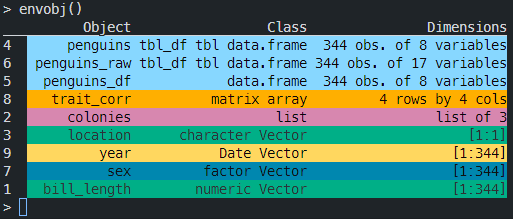

# honeydukes
A collection of 'sweet' 🍭 'magical' 🪄 R tools


A growing collection of 'sweet' 🍭 'magical' 🪄 R tools. Many of the tools have been developed to assist in development environment situations. 
It’s pretty much my miscellaneous R package 📦 but with a cool HP 🧙️ inspired name👍

## Functions

At the moment this package contains the following functions:

* `envobj` prints a ANSI coloured table listing all objects in the current environment and their details, such as object type and dimensions. Useful for when working outside RStudio on a remote server via a ssh terminal

* `corner` prints the top left corner of a larger user defined matrix or data frame. This is very handy in bioinformatics when you are back and forth checking the general contents of a large genotype matrix.

## Installation 
Installing is simple, you will just need to make sure you have the [remotes](https://github.com/r-lib/remotes) package from [cran](https://cran.r-project.org/web/packages/remotes/index.html) installed first.
```r
install.packages("remotes") # if not already installed
remotes::install_github("lpembleton/honeydukes")
```

## Dependencies
This package currently imports functions from the [emphatic](https://github.com/coolbutuseless/emphatic) package by [coolbutuseless](https://github.com/coolbutuseless) for the ANSI colour highlighting.
If installed following the installation instructions {emphatic} should be automatically installed at the same time. 
